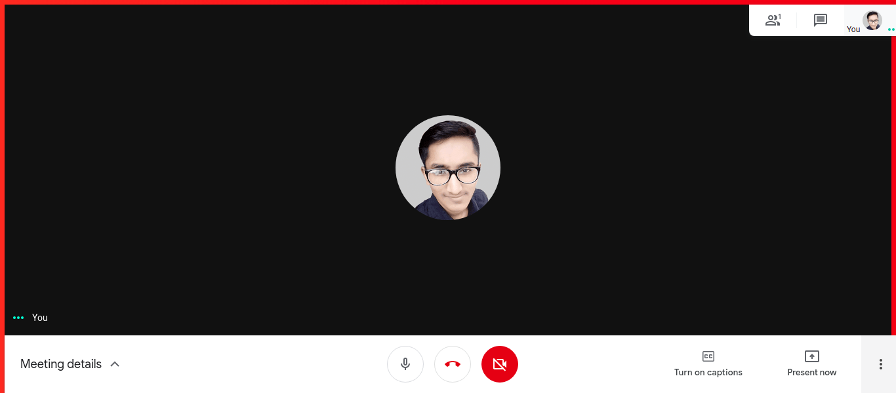

<h1 align="center">Shweta No 🤐</h1>
<h3 align="center">Extension to automatically mute you when joining meetings and show warning border when unmuted.  All so you don't end up like Shweta :grimacing:</h3>

### Screenshot

### Features

1. Automatically mutes you when joining calls
2. Automatically connects to computer audio (for Zoom)
3. Shows a **thick red border** when you are unmuted

### Supported platforms

- [x] Zoom
- [x] Meet

**Note**: Only web versions are supported

### Coming Soon

- [ ] Webex
- [ ] Jitsi meet

Any platform we are missing? [Tell us here](https://github.com/bhumijgupta/Shweta-no/issues/new)

### License

[MIT License](./LICENSE)

### Credits

[Extension icon](https://icons8.com/icons/set/no-microphone) made by [Icons8](https://icons8.com).
