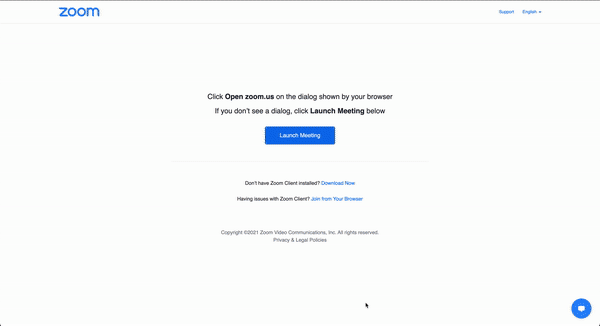

<p align="center"></p>
<p align="center"><h1 align="center">Shweta No 🤐</h1>
<h3 align="center">Extension to automatically mute you when joining meetings and show warning border when unmuted. <br/>All so you don't end up like Shweta :grimacing:</h3>

## Install

[link-chrome]: https://chrome.google.com/webstore/detail/shweta-no/pfhnjonjbjbhhlfkecdgghlkgkpbnocm "Version published on Chrome Web Store"
[link-firefox]: https://addons.mozilla.org/en-GB/firefox/addon/shweta-no/ "Version published on Mozilla Add-ons"

[][link-chrome] [][link-chrome] also compatible with [][link-chrome] [][link-chrome]

[][link-firefox] [][link-firefox]

## Features

1. Automatically mutes you when joining calls
2. Automatically connects to computer audio (for Zoom)
3. Shows a **thick red border** when you are unmuted

## Demo



## Supported platforms

- [x] Zoom
- [x] Meet

**Note**: Only web versions are supported

## Coming Soon

- [ ] Webex
- [ ] Jitsi meet
- [ ] Microsoft teams

Any platform we are missing? [Tell us here](https://github.com/bhumijgupta/Shweta-no/issues/new)

## Development

```
npm i
npm run watch
```

Source files:

1. [shweta-on-meet.js](./source/shweta-on-meet.js) - Logic for interacting with meet
2. [shweta-on-zoom.js](./source/shweta-on-meet.js) - Logic for interacting with zoom

### Compiling production build

```
npm i
npm run build
```

## Support

<a href="https://www.buymeacoffee.com/bhumijgupta" target="_blank"></a>

## License

[MIT License](./LICENSE) &copy; Bhumij Gupta

## Credits

[Extension icon](https://icons8.com/icons/set/no-microphone) made by [Icons8](https://icons8.com).

---

```javascript
if (repo.isCool() && repo.isHelpful()) {
  starRepo();
}
if (repo.hasBug() || user.hasSuggestion()) {
  createIssue();
}
```
